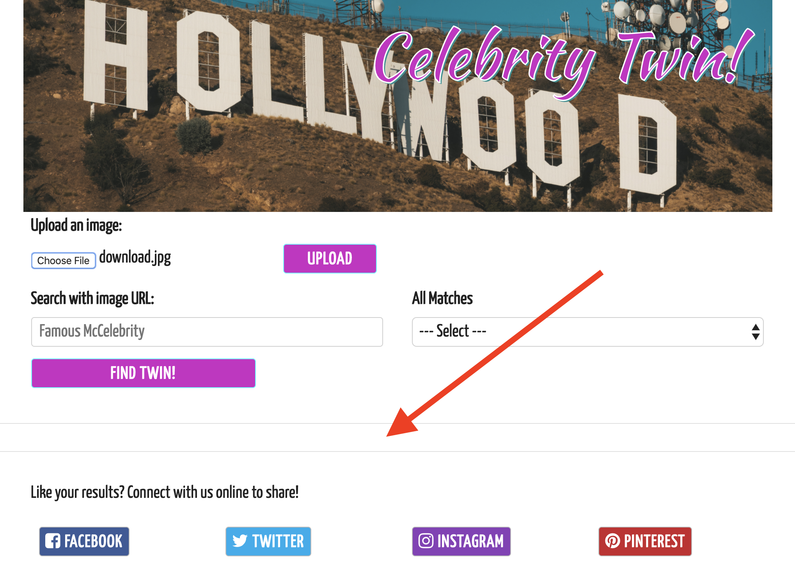
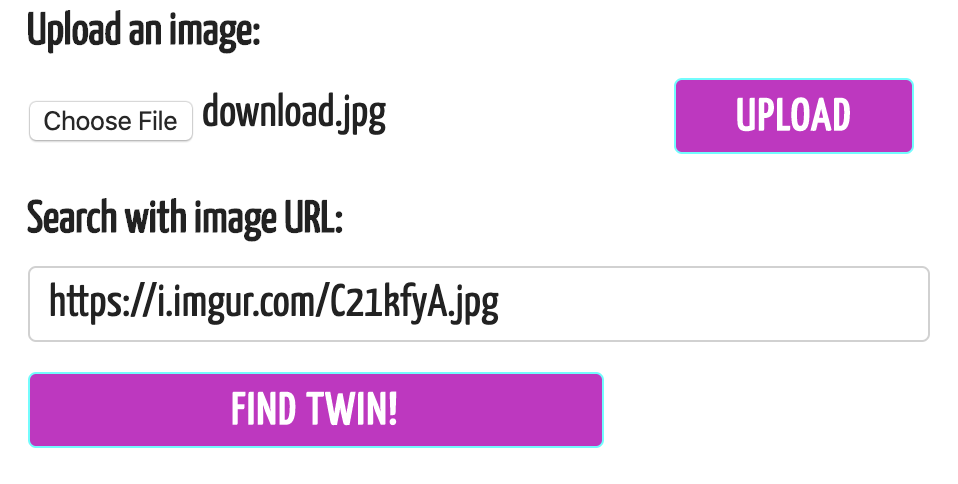
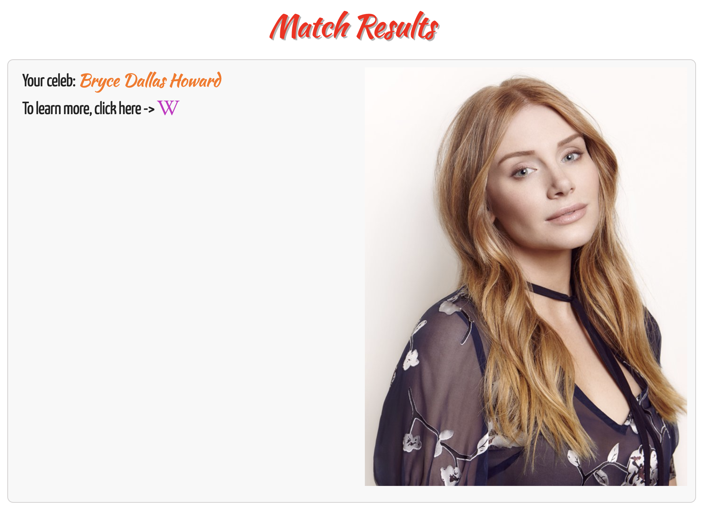
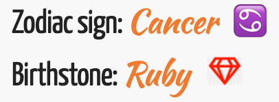
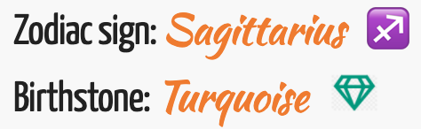
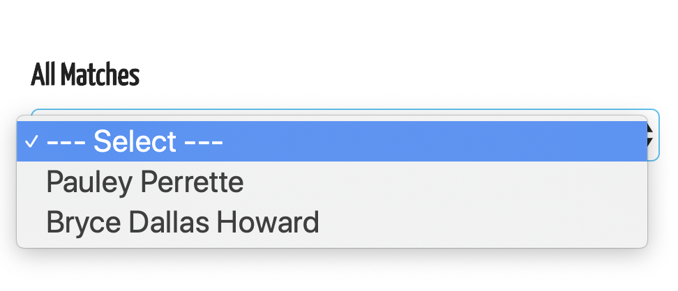

# Celebrity Twin!
​
[Celebrity Twin](https://ajhami.github.io/celebrity_twin/) is corn-fed entertainment for the bored and harmlessly narcissistic. It takes the user's `uploaded images` to find a celebrity *doppelgänger.* Then the mildly voyeuristic user can link to [IMDb](https://www.imdb.com/), [Wikipedia](https://www.wikipedia.org/), and other resources to see what they and their celeb of choice share in common.
​
### [Launch Celebrity Twin](https://ajhami.github.io/celebrity_twin/)
​
## Table of Contents
- Background
- Features
- Tech
- Contributors
- Roadmap
- Walk-through of App
​
## Background
This modern age is as progressive and exciting as it is weird and self-obsessed. Bored people love celebrity—both in reality and in their own minds. This app helps pass the time a little by establishing a personal connection with fanatasy, an individual link with social stardom!
​
## Features
[Celebrity Twin](https://ajhami.github.io/celebrity_twin/) allows the user to `upload` photos and `interact` in an exploratory manner. Rather than approaching the resources of [Google Images](https://www.google.com/imghp?hl=en) *et alia,* with a specific goal in mind, the APIs come up with matches that the user might not have considered. It saves time by gathering informative resources in the form of [IMDb](https://www.imdb.com/) or [Wikipedia](https://www.wikipedia.org/) links and presenting fun tidbits such as `birthplace`, `zodiac sign`, `birthstone`, `favorite recipes`, `pets`, *et cetera (**note:** not all of these features are currently available in the prototype app).*
​
## Tech
[Celebrity Twin](https://ajhami.github.io/celebrity_twin/) relies on the following technology to work:
#### JavaScript Library
- [JQuery](https://jquery.com/)
#### Font Library
- [Google Fonts](https://fonts.google.com/)
#### CSS Frameworks and Resources
- [Skeleton CSS](http://getskeleton.com/)
- [Font Awesome](https://fontawesome.com/)
#### APIs
- [imgur](https://imgur.com/)
- [NameFace](http://nameface.com/)
- [IMDb](https://www.imdb.com/)
- [Wikipedia](https://www.wikipedia.org/)
#### Honorable Mention
- Though not implemented yet on [Celebrity Twin](https://ajhami.github.io/celebrity_twin/), a great resource for customizable `SVG` images and other CSS/Style tools is [Icons8](https://icons8.com/).
​
### Contributors
This is the all-star lineup that is *Los Poderosos:*
​
| Contributor                              | Contribution         |
|:----------------------------------------:| -------------------- | 
| [Alexander Hamilton](https://github.com/ajhami/) | API integration, JavaScript, layout |
| [Terry Gong](https://github.com/terry0532)  | API integration, JavaScript, layout  |
| [Anthony Phan](https://github.com/aphan1982/) | Design, CSS Framework, Styles    |
​
### Roadmap 
Further areas of development include (but aren't limited to!) pulling more content regarding trivia, tidbits, factoids, *et cetera* about the celebrities and creating a more customized, user-oriented experience. Some of these elements could be `horoscope data`, information about the celeb's `hometown`, `interests`, `hobbies`—anything and everything that might provide the user a more personalized experience.

## Walk-through of App
When the user opens the app, the `search result area` is defaulted as being blank—it requires an upload of an image to begin the matching process:



The user either selects an `image file` from their computer or searches online to begin the upload process. Once the image is uploaded, a `URL` will be generated to search the [NameFace](http://nameface.com/) database:



Once the APIs make the match, the `celebrity result field` is displayed populated with an image and links to [IMDb](https://www.imdb.com/) and [Wikipedia](https://www.wikipedia.org/):



Given more development, other bits of information such as `date of birth`, `birthplace`, `zodiac sign`, `birthstone`, or [Wikipedia](https://www.wikipedia.org/) synopsis will be displayed:


Of this additional data, a `birthdate` is key to generating trivia such as `astrological sign` and `birthstone`. These elements are manipulated via CSS rules to change how their display color and emoji symbol are displayed:



*Example code of how CSS rules are used to modify the display output:*
```
#augPeridot {
  filter: hue-rotate(190deg);
}
#sepSapphire {
  filter: saturate(300%);
}
#octOpal {
  filter: hue-rotate(310deg) opacity(30%) brightness(200%);
}
#novTopaz {
  filter: hue-rotate(150deg);
```
*The result:*


A `history of searches` or potential results is kept in local storage to be referred to later:



Though the `social media` sites are just placeholders at present, the idea is that the user can share their results on their favorite social media indulgence of choice:

